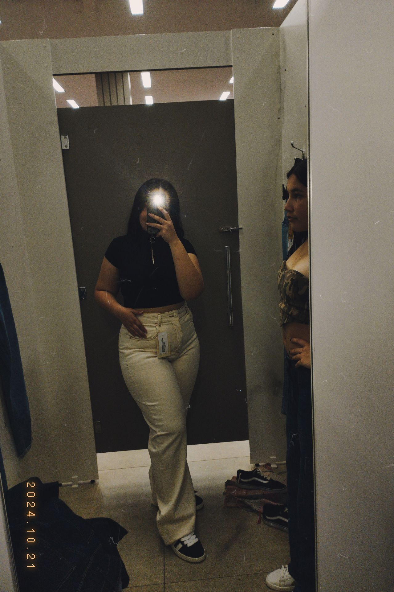
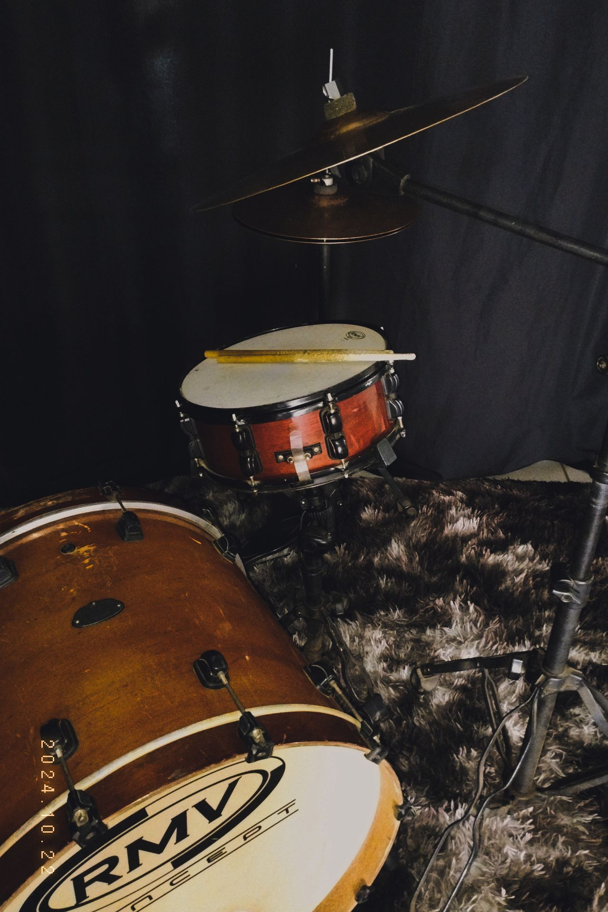

<h1 align="center">

</h1>

  
  

 
- 🥁gosto de tocar bateria 
 
 
- 👩‍🍳gosto de cozinhar
 
 
- ❤️‍🔥catolica
 

 
- 💸
 
 
- 🇻🇦
 
 
- 🎙️ cantora
 
 
- 💰 style.css
 
 
- 🕸️ index.html

 

 
Contatos
 
 

  
 
  
  

 
<h1 align="center">

</h1>

###

<picture align="center">
  <source media="(prefers-color-scheme: dark)" srcset="https://raw.githubusercontent.com/Isaa22/Isaa22/output/github-contribution-grid-snake-dark.svg">
  <source media="(prefers-color-scheme: light)" srcset="https://raw.githubusercontent.com/Isaa22/Isaa22/output/github-contribution-grid-snake-dark.svg">
  
</picture>

